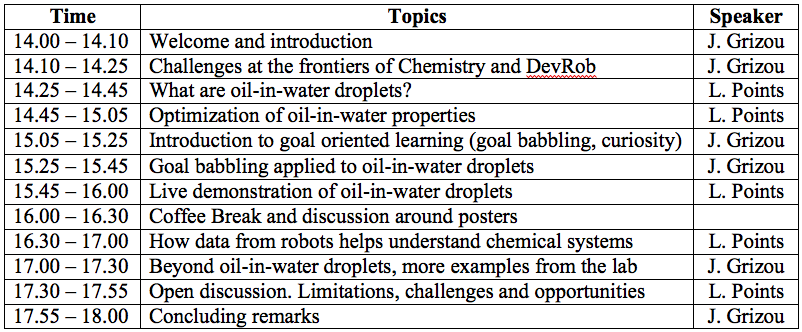

## Welcome to our tutorial on smart chemical robots

We believe principles from developmental robotics can benefit when designing curious robotic assistants for lab environments. In this tutorial, we will introduce and showcase examples from robotic assistants at work in our chemistry lab and how they help us characterize our chemical systems more effectively. In the video below, we showcase our oil-in-water droplet system that can display a fascinating range of behavior.

<iframe width="560" height="315" src="https://www.youtube.com/embed/7cb3stRmBW0?autoplay=1&loop=1&playlist=7cb3stRmBW0" frameborder="0" allowfullscreen></iframe>

<iframe width="560" height="315" src="https://www.youtube.com/embed/OUUUWNLt8Iw?autoplay=1&loop=1&playlist=OUUUWNLt8Iw" frameborder="0" allowfullscreen></iframe>

Our robots are able to perform physical or chemical experiments with the aim to explore the states such complex systems can exhibit, a challenge alike sensory-motor exploration in humans and robots. The tutorial will be of special interest for researchers interested in sensory-motor exploration and its application outside of robotics and developmental sciences.

Our aim is to highlight the potential benefits of interdisciplinary work at the interface of physics, chemistry, robotics and AI.

For more details and background information, please read the [tutorial proposal](tutorial_proposal_final.pdf).

### Schedule

Provisional schedule is as follow:

We are looking for a senior researcher willing to give a 20 minutes perspective talk on the subject and its articulation with the DevRob community. If you are interested or know someone that might be, please contact me at <a href= "jonathan.grizou@glasgow.ac.uk">jonathan.grizou@glasgow.ac.uk</a>.

### Selected publications

- **Gutierrez, Juan Manuel Parrilla, et al. "Evolution of oil droplets in a chemorobotic platform." Nature communications (2014)**

This is the first work published by the group in that area. It demonstrates how we can artificially evolve oil-in-water droplets to maximize different behaviors type, such as speed or division.

Link to journal: https://www.nature.com/articles/ncomms6571

- **Vasilios Duros, Jonathan Grizou, et al. "Human vs Robots in the Discovery and Crystallization of Gigantic Polyoxometalates". Angewandte Chemie (2017)**

In this work, we use active learning classification methods to define the next experiments to perform to characterize faster a crystalization 'zone' of a new polyoxometalate cluster.

Code and data: https://github.com/croningp/crystal_active_learning
Link to journal: http://onlinelibrary.wiley.com/doi/10.1002/anie.201705721/abstract

- **"Artificial Intelligence Exploration of Unstable Protocells Leads to Predictable Properties and Discovery of Collective Behaviour", Submitted to PNAS**

This paper presents our efforts to understand the underlying physical and chemical processes at work in our droplet system. We also explore the impact of the chemical environment of the droplets on their behaviors.

- **"Artificial Evolution of Droplet Protocells in a Chemical Robot with Configurable Environments Leads to Phenotypic Plasticity", submitted to Nature Communication**

This paper explores the impact of the physical environment on the droplets behaviors. To this end, we encapsulated the functionalities of our chemical robots into a 3D printed devices, allowing us to modify the shape of the arena.

### Jobs opportunities

Job opportunities are available for prospective PhD students and PostDocs with a strong desire to work in this innovative and challenging research program. We encourage interested researchers to attend to the tutorial and contact us for more information.

### Contact

The work presented is undergone by the Chemobot team within the [Cronin Group](http://www.chem.gla.ac.uk/cronin/), in the School of Chemistry at the University of Glasgow.

The tutorial is organized by:

- [Jonathan Grizou](http://jgrizou.com/), team leader of the Chemobot team (4 PostDocs, 3 PhD students, 1 Intern), background in Develepmental Robotics.
- Laurie Points, PhD student in the Chemobot team, background in Chemistry.
- [Lee Cronin](http://www.chem.gla.ac.uk/cronin/members/Lee/), Professor and head of the [Cronin Group](http://www.chem.gla.ac.uk/cronin/) (55 members), his group is pioneering research at the intersection of Chemistry, Robotics and Artificial Intelligence.
